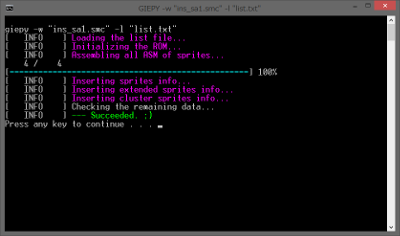
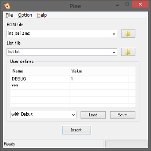

# GIEPY

 

This is a sprite insertion tool for Super Mario World ROM.

Main program is written in C language.  
And the main patches are assembly file for Asar.


## Feature

This tool has the features like sprite tool, but has the following enhancements.

- More than 600 sprites can be inserted. (Including replacement of existing sprites, up to 1024 can be inserted.)

- Any type of sprite can be inserted into an arbitrary number. (For example, you can insert generator into sprite number 0.)

- Added new type sprites ... **Initializer**, **Scroller**


Since the meaning of the extra-bits has been changed so far, attention is necessary.

However, there is also a way to use it as before.


## How to use

https://boldowa.github.io/GIEPY/


## How to compile

This program require [cmake](https://cmake.org).

Please install it.

And this project is submodule for [smw-utils project](https://github.com/boldowa/smw-utils).

With this project alone, you can't build.

### Procedure

1. Clone [this repository](https://github.com/boldowa/smw-utils).

2. Update submodules.

3. Type it.

```
cmake -DCMAKE_BUILD_TYPE=Release .. && cmake --build . --target giepy
```


## TODO

### Sprite config file formats

- [ ] Yaml
- [ ] Ucl

### Uninstaller

I'm planning to create another project for these.

- [ ] Romi's Sprite Tool
- [ ] PIXI
- [ ] Tessera
- [ ] Daiyousei

