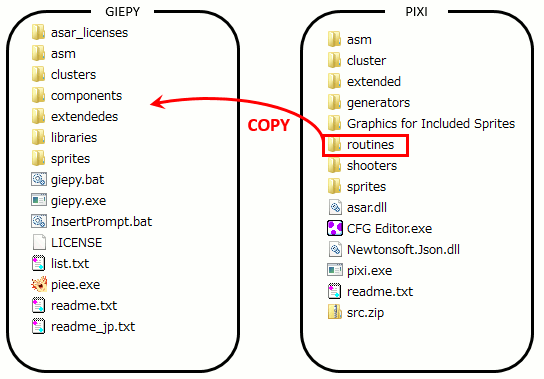

# Requires

- [GIEPY](/#download)

- [PIXI](https://smwc.me/s/16731)

- ROM file that has not installed any SpriteTools

# Procedure

1. Copy **routines** directory from PIXI to GIEPY.  
   

2. Set the options as follows.  

   |Option             |value       |
   |:------------------|:----------:|
   |PIXI compatible    |true(Enable)|
   |Libraries directory|routines    |

   If you previously installed the PIXI compatibility option disabled,  
   add the following as well.

   |Option         |value       |
   |:--------------|:----------:|
   |Force-reinstall|true(Enable)|

3. Edit the **[sprites list file](/fspecs/list)**.

4. Correct the sprite's **[config file](/fspecs/spconfig)** for GIEPY.  

5. Execute GIEPY.

I recommend that you disable the **Force re-install** option after completing the procedure.

# Notes

Some sprites probably need modifications.

[See here](spt#notes).

# Troubleshooting

## macro not found

```
E:\giepy_v1.00\sprites\normal\pixi\FireBro.asm:27: error: Unknown macro [%SubOffScreen()]
E:\giepy_v1.00\sprites\normal\pixi\FireBro.asm:38: error: Unknown macro [%SubOffScreen()]
E:\giepy_v1.00\sprites\normal\pixi\FireBro.asm:183: error: Unknown macro [%GetDrawInfo()]
E:\giepy_v1.00\sprites\normal\pixi\FireBro.asm:271: error: Define !ExtendedOffset not found
Assembling of "E:\giepy_v1.00\sprites\normal\pixi\FireBro.asm" failed...
CFG file "E:\giepy_v1.00\sprites\normal/pixi/FireBro.json" processing failed...
```

There are multiple causes to consider.

1. **PIXI Compatible mode is disabled**  
   [Did you operate according to the procedure?](#procedure)

2. **PIXI's "routines" directory us not copied.**  
   [Did you operate according to the procedure?](#procedure)

3. **Wrong library directory specification**  
   Correct library directory specification.

4. **Incorrect library file name**  
   Correct sprite 's asm file \(or library file name\).

---


