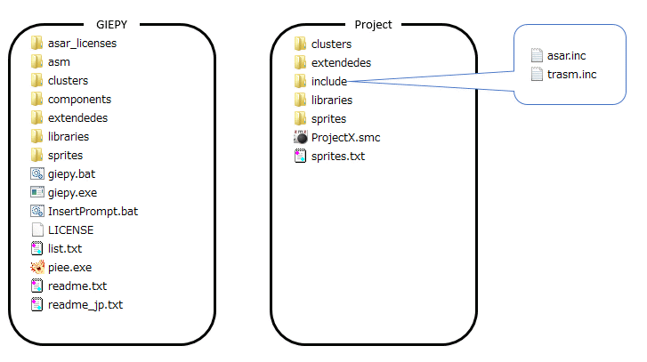

# Permanently add common defines

In this case, add the definition to the following include file.

- **asm/include/asar.inc**

- **asm/include/trasm.inc**

# Add defines for each project

In this case, use the local define file.

## How to use

1. Make **include** directory in same as [list file](../fspecs/list) directory.

2. Make these files.

- **include/asar.inc**

- **include/trasm.inc**

## Note

When using these files, system include files are ignored.

# Add temporary defines

Use define option. \([in CUI](../cui/how#command-line-options)\) \([in GUI](../gui/how#defines-list-control)\)

---

