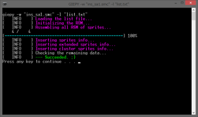

It is cui interface program.

Compared to the GUI(PIEE), the insertion speed is fast.

# Usage

giepy \[options\] \<ROM file name\>

**e.g.** `giepy -p -w -L routines -l pixi_list.txt smw_rom.smc`

# Command Line options

|short|long|description|example|
|:-:|:--:|:------|:---|
|-b|--bytes|enable extra bytes feature. **This option is valid only when installing the system.**[^1]|-b|
|-p|--pixi|enable PIXI compatible mode. **This option is valid only when installing the system.**[^1]|-p|
|-f|--force|force re-install giepy.|-f|
|-t|--notooltip|disable to generate custom tooltip files.|-t|
|-l|--list|specify the list file path. (default: **list.txt**)|-l "sprites list.txt"|
|-L|--library|specify the libraries directory. (default: **libraries**)|-L "routines"|
|-s|--sprite|specify the sprites directory. (default: **sprites**)|-s "enemy"|
|-e|--extended|specify the extended sprites directory. (default: **extendedes**)|-e "extended enemy"|
|-c|--cluster|specify the cluster sprites directory. (default: **clusters**)|-c "cluster enemy"|
|-D|--define|add asm defines.|-D DEBUG -D STR="strings" --define VAL=3|
|-u|--uninstall|uninstall GIEPY from ROM image.|-u|
|-w|--nowarn|disable to verbose warnings|-w|
|-d|--debug|verbose debug informations.|-d|
|-v|--version|show version information.|-v|
|-?|--help|show program usage messages.|-?|

# Easy use procedure for Windows

1. When using SA-1, insert SA-1 patch.

2. Use Lunar Magic to edit the ROM at least once.

3. Open "InsertPrompt.bat" with text editor(e.g. notepad).  
Set the option on line 10.

4. Launch "InsertPrompt.bat".

5. Input ROM file name (or you can D&D the ROM file in the window.)

6. Input List file name (or you can D&D the List file in the window.)

---

[^1]: If you want to always valid it, use the **-f** option together.

