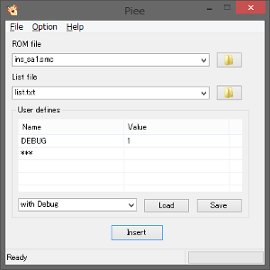
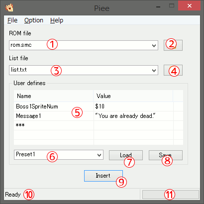
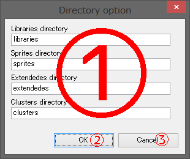
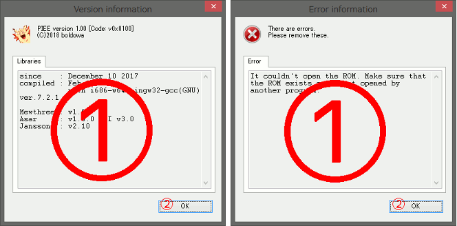

It is gui interface program for Windows.

Since it is honest rough making, there may be strange issues.  
Perhaps the frequency of bug finxes is low.

# TOC

- [Program Menu](#program-menu)

- [Main Window](#main-window)

- [Directory Option Dialog](#directory-option-dialog)

- [Information / Error Dialog](#information--error-dialog)

- [INI file](#ini-file)

# Program Menu

## File

|menu     |description|
|:--------|:----------|
|Insert   |Insert sprites into ROM file.|
|Uninstall|Uninstall systems from ROM file.|
|Abort    |Abort the process.<br>This is only valid during insertion or uninstallation.<br>\* If this function is used, the operation of the program may become unstable.|
|Exit     |Exit the program.|

## Option

|menu     |description|
|:--------|:----------|
|Use PIXI compatible code           |Enable PIXI compatible mode.|
|Enable Extra Bytes                 |Enable Lunar Magic's Extra Bytes feature.|
|Force re-install                   |Force re-install system code.|
|Disable to generate Custom Tooltips|Disable to generate "ssc", "mwt" and "mw2" files.|
|Show Debug Information             |Show debug information after insert / uninstall|
|Don't care Warnings                |Don't show error message after insert / uninstall|
|Directory option                   |Open the [Directory Option Dialog](#directory-option-dialog)|

## Help

|menu     |description|
|:--------|:----------|
|Version info|Open the [Information / Error Dialog](#information--error-dialog)|


# Main Window



|control  |name       |description|
|----:----|:----------|:----------|
|①|ROM file path combo box|Specify the path of the ROM file to insert sprites or uninstall GIEPY system.<br>The number of recently used files can be changed with [INI file](#ini-file).|
|②|ROM file select dialog button|Open the file selection dialog for selecting the ROM file.|
|③|List file path combo box|Specify the path of the list file for sprite insertion.<br>The number of recently used files can be changed with [INI file](#ini-file).|
|④|List file select dialog button|Open the file selection dialog for selecting the list file.|
|⑤|User defines list view|List of user definitions.<br>Please see [Defines list control](#defines-list-control).|
|⑥|User defines preset combo box|List of the user define presets.<br>Please see [Defines list control](#defines-list-control).<br>The number of defines presets can be changed with [INI file](#ini-file).|
|⑦|User preset load button|Load the definition list selected in the combo box.<br>Please see [Defines list control](#defines-list-control).|
|⑧|User preset save button|Save the definition list with the preset name set in the combo box.<br>Please see [Defines list control](#defines-list-control).|
|⑨|Insert button|Insert sprites into the ROM.|
|⑩|Status bar|Display the current processing status.|
|⑪|Process Progress Bar|Display the progress of ASM insertion.|

## Defines list control

### How to use controls

#### Add define

1. Click `***` cell twice.

2. Input name of define into text box.

3. Push **Enter** key.

#### Edit define

1. Click cell that you want to edit twice.

2. Input name of define into text box.

3. Push **Enter** key.

#### Delete define

1. Click row that you want to delete.

2. Push **delete** key.

#### Save preset

1. Input preset name into **User defines preset combo box**(⑥).

2. Push **Save** button(⑧).

It adds the preset to the combo box(⑥).

**It doesn't save to the file.**  No message is displayed.

#### Load preset

1. Select preset from **User defines preset combo box**(⑥).

2. Push **Load** button(⑦).

It loads the preset into the list view(⑤).

**It doesn't read from the file.**  No message is displayed.

### How to reference from ASM

#### From ASAR

Access by **!definename**.

For example, 

|Name|Value|
|:---|:----|
|BossNumber|1|
|HelpMsg|"Help me!!"|
|HitPoint|$0A|

It'll be expanded as follows:

```
!BossNumber = 1
!HelpMsg    = "Help me!!"
!HitPoint   = $0A
```

#### From TRASM

Access by **definename** (Same as label).

For example, 

|Name|Value|
|:---|:----|
|BossNumber|1|
|HelpMsg|"Help me!!"|
|HitPoint|$0A|

It'll be expanded as follows:

```
BossNumber = 1
HelpMsg    = "Help me!!"
HitPoint   = $0A
```


# Directory Option Dialog



|control  |name       |description|
|----:----|:----------|:----------|
|①|Directory name text boxes|Set the directory name here.|
|②|OK button|Save the changes and close the dialog.<br>If there is even one blank setting,<br>an error dialog will be displayed.|
|③|Cancel button|Discard the changes and close the dialog.|


# Information / Error Dialog



|control  |name       |description|
|----:----|:----------|:----------|
|①|Information Tab-view|Display version information and error information.|
|②|OK button|Close the dialog.|


# INI file

Settings are saved in "piee.ini".

## \[System\] section

|key|description|
|:--|:-------|
|X|The X position on startup.|
|Y|The Y position on startup.|
|RecentRomNums|Maximum number of items to store in recently used ROM files.|
|RecentListNums|Maximum number of items to store in recently used List files.|
|DefineListNums|Maximum number of defines preset. It disappears in order from the last saved.|

## \[Flags\] section

|key|description|
|:--|:-------|
|IsForce|The setting for **Force re-install** option.|
|IsExtraBytes|The setting for **Enable Extra Bytes** option.|
|IsPixiCompatible|The setting for **Use PIXI compatible code** option.|
|DisableSscGen|The setting for **Disable to generate Custom Tooltips** option.|
|IsDebug|The setting for **Show Debug Information** option.|
|IsDisableWarn|The setting for **Don't care Warnings** option.|

## \[Dirs\] section

|key|description|
|:--|:-------|
|LibrariesDir|Libraries directory name.|
|SpritesDir|Sprites directory name.|
|ExtendedesDir|Extended sprites directory name.|
|ClustersDir|Cluster sprites directory name.|

## \[RecentRoms\] section

|key|description|
|:--|:-------|
|path(Num)|The item of recently used ROM file.|

## \[RecentLists\] section

|key|description|
|:--|:-------|
|path(Num)|The item of recently used List file.|

## \[Defines(Num)\] section

|key|description|
|:--|:-------|
|Name|Define preset name|
|define(Num)|Definition name and value pair. They are delimited by ":".|

---


