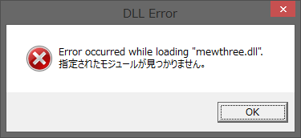

# Overview

This is a tool for inserting sprites into Super Mario World ROM image.

# Features

- Up to 1024 sprites can be inserted, including replacement of SMW original sprites.

- It can insert various kinds of sprites. They can be assigned to any number you like.

- This tool is compatible with TRASM and ASAR sprites. This tool automatically detects the ASM type.

- The initialization patch of this tool has a strict checking function.
It is easy to detect conflicts with other tools.

- This tool has a powerful library search function.
There is no need to call the library with macros anymore.

- The main program is written in C language.
Therefore, the executable file size is small and fast.
Installation of the runtime package is also unnecessary.

- This tool supports LM's extra bytes feature.

- It's compatible with SpriteTool and PIXI sprites.

- This tool has an uninstall option.
When you no longer need this tool you can delete it at any time.

# Require

Lunar Magic version **1.65 or higher**.

When using the exita bytes feature, version **1.80 or higher** is required.

# Compatibility with other tools

## Compatible

- [SA-1 Pack v1.26 (Reduces Slowdown)](https://smwc.me/s/15116)

- [GPS V1.3.0 - Gopher Popcorn Stew](https://smwc.me/s/16493)

- [AddmusicK 1.0.5](https://smwc.me/s/14583)

- [UberASM Tool 1.2](https://smwc.me/s/16540)

- [UNKO v1.31 (Object Insertion Tool)](https://smwc.me/s/16189)

- [ObjecTool 0.4](https://smwc.me/s/16040)

- [Lui37's Overworld Sprite Patch](https://smwc.me/1413938)

- [VWF Dialogues Patch v1.01](https://smwc.me/s/6863) \([^1]\)

- [VWF Level Intros v. 1.21](https://smwc.me/s/16065) \([^1]\)

  [^1]: Only LoROM is supported.

I haven't checked anything other than these.
Other than the tools listed here may work.

## Incompatible

You can't use these tools together.  
*It is* **NOT** *incompatible with sprite files.*

- [Romi's Spritetool - v1.41](https://smwc.me/s/14583)

- [Tessera, v. 0.52 (imamelia's Sprite Tool)](https://smwc.me/s/4601)

- [PIXI v1.2.1 - Sprite Insertion Tool](https://smwc.me/s/16731)

- [Daiyousei, the unsanctioned sprite tool (v0.4.1)](https://smwc.me/1451004)

# Download

- [Github](https://github.com/boldowa/GIEPY/releases/latest)

# Manual

## How to use

- [CUI interface](cui/how)

- [GUI interface](gui/how)

## File formats

- [Sprites list file format](fspecs/list)

- [Sprites config file format](fspecs/spconfig)

## Sprite coding information

- [TRASM sprite file coding guide](asmspec/trasm)

- [ASAR sprite file coding guide](asmspec/asar)

- [Library file coding & using guide](asmspec/library)

- [RAM](asmspec/ram)

## Advanced

- [Use Romi's Sprite Tool's sprites](advanced/spt)

- [Use PIXI's sprites](advanced/pixi)

- ~~Use other tool's sprites~~

- [Add user definitions](advanced/userdef)

- [Use for multiple projects](advanced/multiprj)

## Technical information

- [ASM libraries](tec/libraries)

- [ASM defines and macros](tec/macros)

- [System patch info](tec/syspatch)

- [Doxygen documents](doxygen/html/index.html)


# Troubleshooting

## DLL Error



It seems that some of the files are broken. Please try downloading again.

## Assertion

In the first use, the following error may be output in some cases.

```
E:\giepy_v1.00\asm\include\macros.inc:153 (called from E:\giepy_v1.00\asm\giepy/load.asm:68): error: Assertion failed [assert $90e7c9 == read3($02a866)]
E:\giepy_v1.00\asm\include\macros.inc:84 (called from E:\giepy_v1.00\asm\giepy/normspr.asm:19): error: Assertion failed [assert $08a9 == read2($018172)]
E:\giepy_v1.00\asm\include\macros.inc:85 (called from E:\giepy_v1.00\asm\giepy/normspr.asm:19): error: Assertion failed [assert $c89d == read2($018172+2)]
   :
E:\giepy_v1.00\asm\include\macros.inc:85 (called from E:\giepy_v1.00\asm\giepy/tweaks.asm:13): error: Assertion failed [assert $9d14 == read2($01c089+2)]
Assembling of "E:\giepy_v1.00\asm\giepy.asm" failed...
```

In this case, some tools or patches are in conflict.  
Uninstall conflicting tools.

## Sprite not found

```
CFG file "scroller/l2_onoff_scr.json" was not found in the search path.
Failed to load the CFG file "scroller/l2_onoff_scr.json"...
```

There are multiple causes to consider.

1. **Specifying an incorrect sprite directory**  
Correct sprites directory specification.

2. **Incorrect specification of list**  
Collect the list file.

## Label not found

```
E:\giepy_v1.00\sprites\scroller\l2_onoff_scr.asm:75: error: Label UpdateLayerPos not found [jsl UpdateLayerPos]
Assembling of "E:\giepy_v1.00\sprites\scroller\l2_onoff_scr.asm" failed...
CFG file "E:\giepy_v1.00\sprites\scroller/l2_onoff_scr.json" processing failed...
```

There are multiple causes to consider.

1. **Wrong library directory specification**  
Correct library directory specification.

2. **Incorrect routine name**  
Correct sprite 's asm file.

# License

License of GIEPY is [MIT license](https://github.com/boldowa/GIEPY/blob/master/LICENSE).

And GIEPY is using these libraries and softwares.

|Library                                      |Copylight                                          |License                                                                |
|:--------------------------------------------|:--------------------------------------------------|:----------------------------------------------------------------------|
|[Asar](https://github.com/RPGHacker/asar)    |&copy;Alcaro, p4plus2, Raidenthequick and RPGHacker|[LGPLv3](https://github.com/RPGHacker/asar/blob/master/LICENSE)        |
|[TRASM](https://github.com/boldowa/Trasm)    |&copy;1994 Norman Yen AKA 1000 Miles \[Tricks\]    |[PUBLIC DOMAIN](https://github.com/boldowa/Trasm/blob/master/trasm.txt)|
|[Jansson](https://github.com/akheron/jansson)|&copy;2009-2016 Petri Lehtinen                     |[MIT](https://github.com/akheron/jansson/blob/master/LICENSE)          |
|[bolib](https://github.com/boldowa/bolib)    |&copy;2017-2018 boldowa                            |[MIT](https://github.com/boldowa/bolib/blob/master/LICENSE)            |

---

