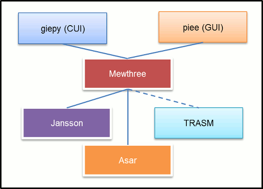

# Program module function

**giepy**(CUI interface) and **piee**(GUI interface) is using **Mewthree** module.

**Mewthree** module is using **Asar**, **Jansson** and **TRASM** module.

# Division of the roles

The following shows the rough division of roles of modules.

## giepy

- Reading program arguments

- Output assemble information

## piee

- Setting options

- Load / Save options (-> INI file)

- Output assemble information

## Mewthree

It is main module.

- Read the sprites list file

- Read the the sprite cfg file

- Judge sprite's asm file type

- Management libraries

- Insert / Remove sprite tables

- Insert / Remove sprite data

- Read / Write ROM file

- Read / Write text(asm) file

## Asar

- Assemble the ASM file for Asar

## TRASM

- Assemble the ASM file for Asar

## Jansson

- Read (and write) the Json file

# Program design pattern

Many sources are coded according to the pattern [here](https://github.com/boldowa/oopc).

This is a design model for object-oriented development in C language.

# Source list of GIEPY

## giepy module

|File                  |Description                                             |
|:---------------------|--------------------------------------------------------|
|src/cui/main.c        |Entry point for CUI interface.                          |
|src/cui/Observer.c    |Message display module for CUI                          |
|src/cui/Console.c     |Module for controlling console window                   |
|src/cui/Option.c      |Option reading module                                   |
|src/cui/ParseCmdDefs.c|Define option data reading module                       |

## piee module

|File                         |Description                                             |
|:----------------------------|--------------------------------------------------------|
|src/win32/wmain.c            |Entry point for GUI interface.                          |
|src/win32/Observer.c         |Message display module for GUI                          |
|src/win32/MainWndProc.c      |Main window control module                              |
|src/win32/DirButtonProc.c    |ROM/List file select button control module              |
|src/win32/FileComboBoxProc.c |ROM/List file combo box control module                  |
|src/win32/NewListViewProc.c  |Defines list view control module                        |
|src/win32/NewLVEditProc.c    |Defines list view's edit box control module             |
|src/win32/PieeDialog.c       |Common dialog control module                            |
|src/win32/DirOptDialogProc.c |Directory option dialog control module                  |
|src/win32/InfoDialogProc.c   |Information dialog control proc                         |
|src/win32/IniMan.c           |INI File management module                              |

## mewthree module

|File                         |Description                                             |
|:----------------------------|--------------------------------------------------------|
|src/mewthree/MewInterfaces.c |The interface with GUI and CUI                          |
|src/mewthree/Mewthree.c      |Mewthree main module                                    |
|src/mewthree/Workspace.c     |Workspace control module                                |
|src/mewthree/SearchPath.c    |SearchPath control module                               |
|src/mewthree/MewEnv.c        |Mewthree's environment module                           |
|src/mewthree/RomMap.c        |RomMap data conversion module                           |
|src/mewthree/Rats.c          |Rats data write module                                  |
|src/mewthree/Uninstall.c     |Uninstall module                                        |
|src/mewthree/InitializeRom.c |ROM Initialize (System install) module                  |
|src/mewthree/CollectInfo.c   |ROM information collection module                       |
|src/mewthree/ChkAsmType.c    |ASM type detection module                               |
|src/mewthree/ParseCfg.c      |Sprite's config file parser module                      |
|src/mewthree/ParseList.c     |Sprite list file parser module                          |
|src/mewthree/Json.c          |Jannson module controller module                        |
|src/mewthree/Libraries.c     |Libraries insertion module                              |
|src/mewthree/LibsInsertMan.c |Libraries insertion status management module            |
|src/mewthree/AssembleAll.c   |Common assemble module                                  |
|src/mewthree/Asar.c          |Asar module controller module                           |
|src/mewthree/Trasm.c         |TRASM module controller module                          |
|src/common/PipeMan.c         |Pipe controll module (it is using in Trasm.c)           |
|src/mewthree/Export.c        |Label/Macro export module                               |
|src/mewthree/Sprites.c       |Sprite table insertion module                           |
|src/mewthree/ExtClsSpr.c     |Extended/Cluster sprite table insertion module          |
|src/mewthree/Exbytes.c       |Extra Bytes length adjustment module                    |

## Other (Common modules)

|File                         |Description                                             |
|:----------------------------|--------------------------------------------------------|
|src/common/Environment.c     |Environment module for CUI and GUI modules              |
|src/common/Funex.c           |Conditional branching module                            |
|src/common/GetFmtStr.c       |Display character string acquisition module             |
|src/smw/libsmw.c             |SMW data analysis module                                |
|src/dll/asardll.c            |Asar module interface                                   |
|src/dll/MewthreeDll.c        |Mewthree module interface                               |

---

